# Softwear

Online clothing store web app. We sell our own products, made with the highest quality fabrics and cloths, as well as the best brands on the market. We promote reducing clothing waste, so everything on sale is guaranteed to last more than two years, thus fighting climate change.

Based on minimalistic design bringing user experience upfront.

We provide a catalog that can be filtered through different categories, allowing users to access all products intuitively with ease. Furthermore, users can save a wish list for future transactions. Once the shopping cart is done, a checkout may be fullfilled.


## Members

|            **Name**           |             **Mail**             |  **Github User** |
|:-----------------------------:|:--------------------------------:|:----------------:|
| Pablo Pinillos Trigueros      | p.pinillos.2019@alumnos.urjc.es  | PabloPinillos    |
| Adrián Sánchez Guirado        | a.sanchezgu.2019@alumnos.urjc.es | a-sanchezgu-2019 |
| Jorge Esteban Pérez           | j.esteban.2019@alumnos.urjc.es   | JEstebanPerez    |
| Ana Cristina Acosta Hernández | ac.acosta.2017@alumnos.urjc.es   | AnaAcostaH       |
| Mario Rojas Padrón            | m.rojas.2019@alumnos.urjc.es     | MarioRP-01       |


## Screens

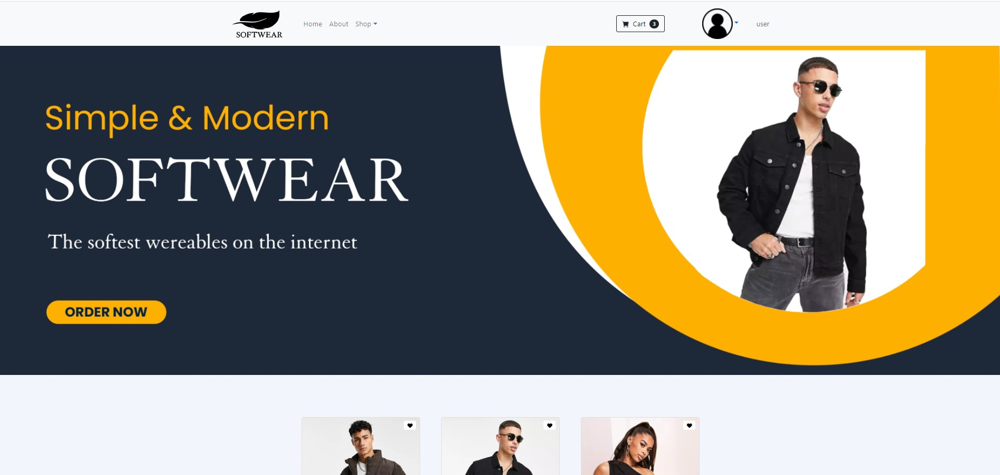
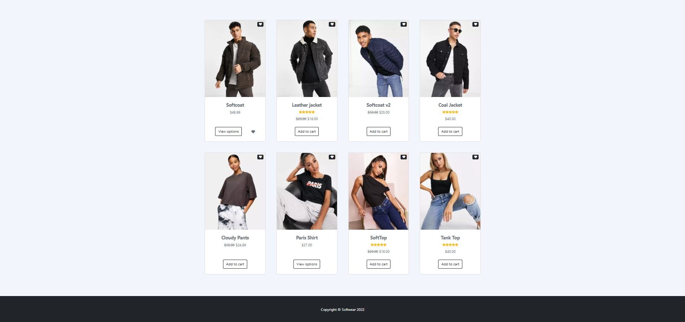
- Index: landing page with products ordered by relevance. This filter can be changed to categories. A user can sign in or sign up from this screen. Clothes can be sent to the cart and wishing list from here.
\
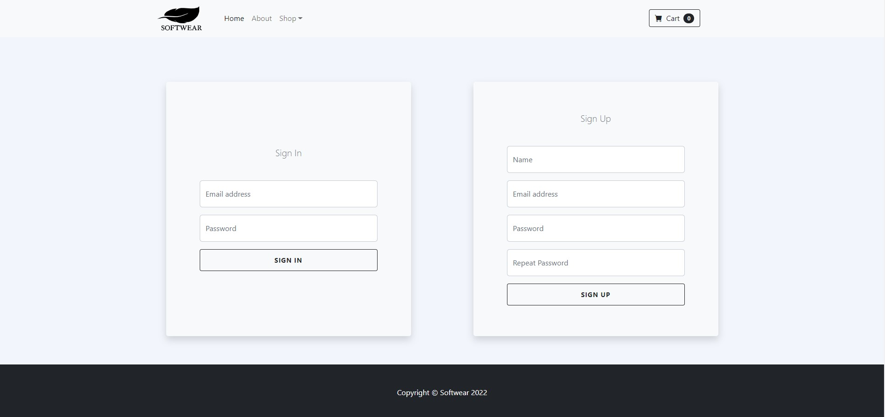
- Login / register: where a user can create an account or log into it with a mail adress, a nickname and a password.

\
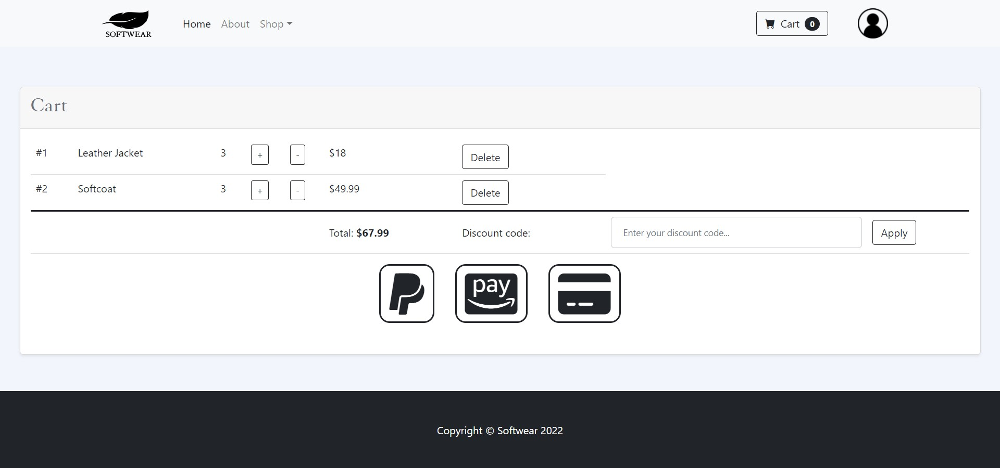
- Cart: list with products the user wants to buy. To end the transaction the user must be logged in.

\
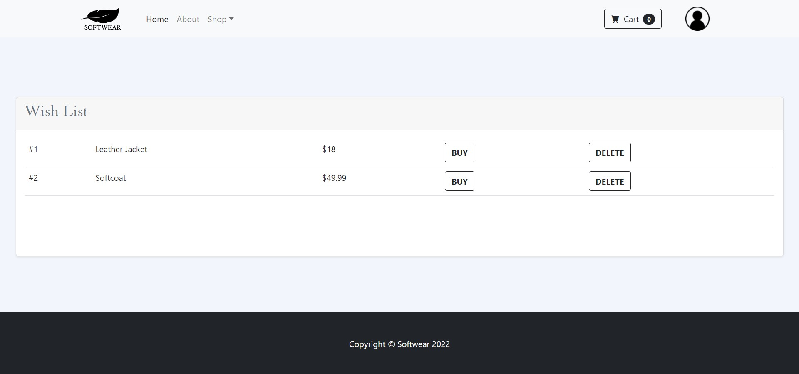
- Wish list: list with products the user likes and can add to cart. They can be added from this list.

\
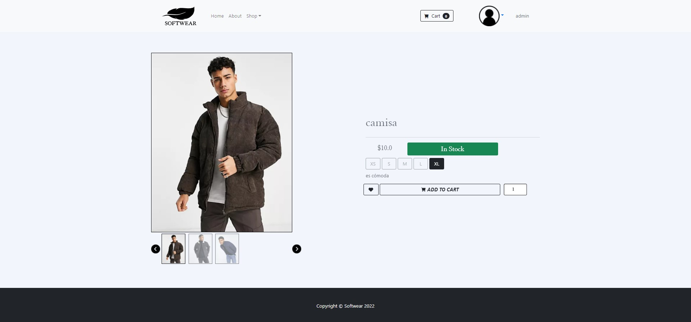
- Product view: where a single product is displayed and specific details are shown. 

\
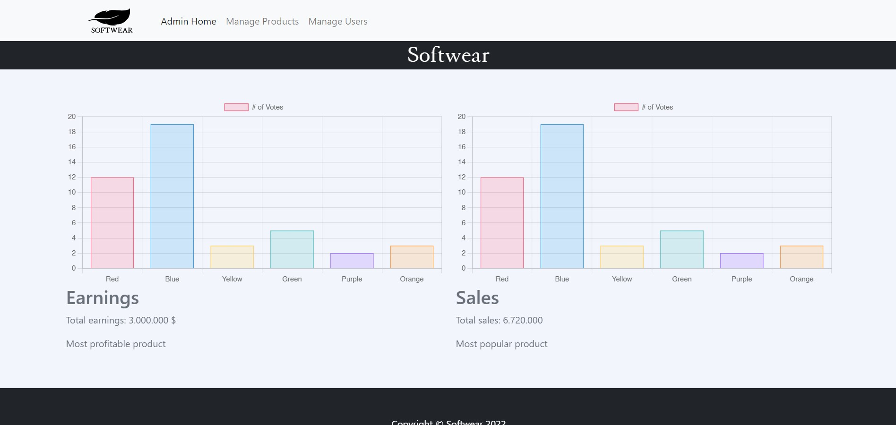
- Admin home: where admins can choose what to do (manage categories, manage users, manage products) and a sales graph is displayed.

\
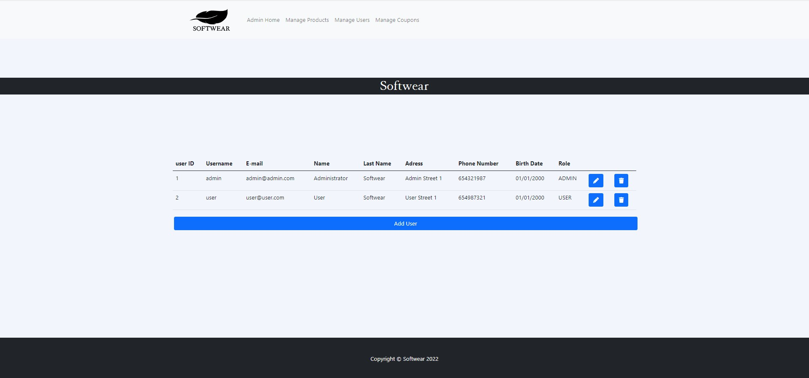
- Manage users: where an admin can ban a user, make a user admin or revoke admin privilege from a user.

\
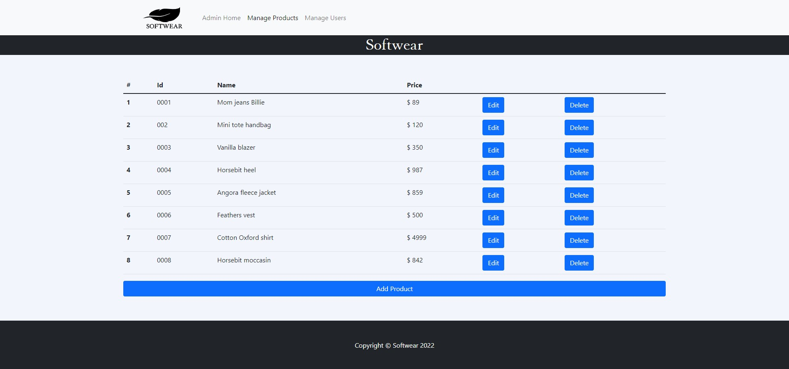
- Manage products: where an admin can create, modify and delete products. 

\
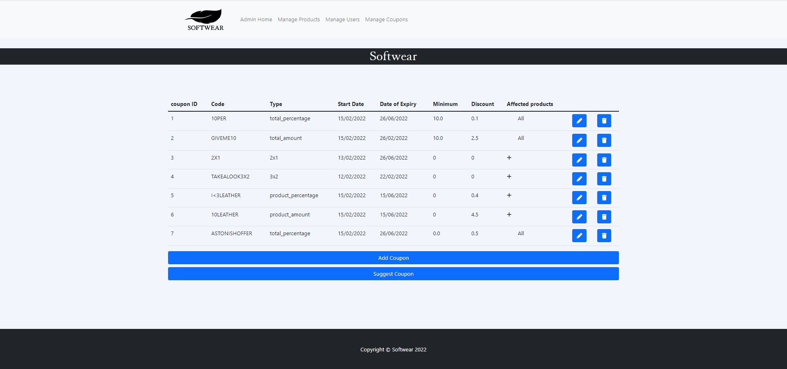
- Manage coupons: where an admin can create, modify and delete products. 

\
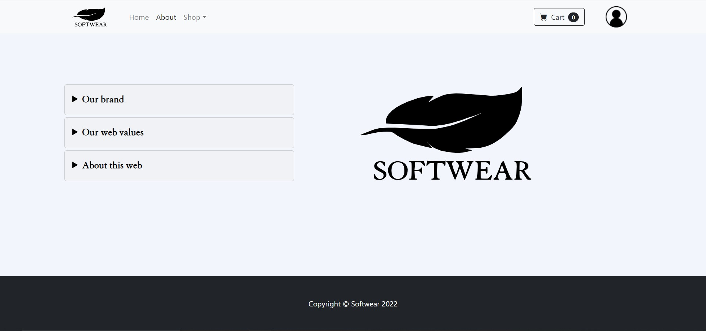
- About: some information about us: the brand, our values and the webpage.

\
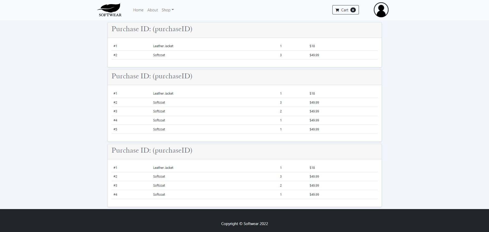
- Purchase history: different purchases with the products information. 

\
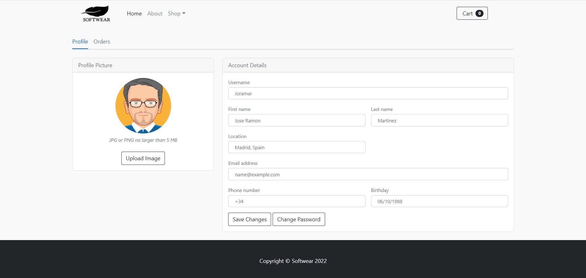
- User profile: account details of each user.

\
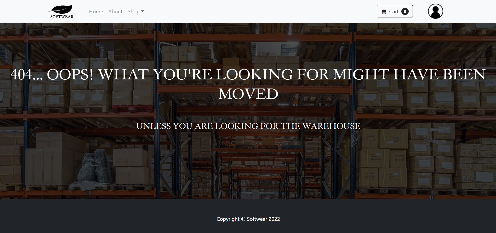
- Error: shown when there is an error with loading page.

\
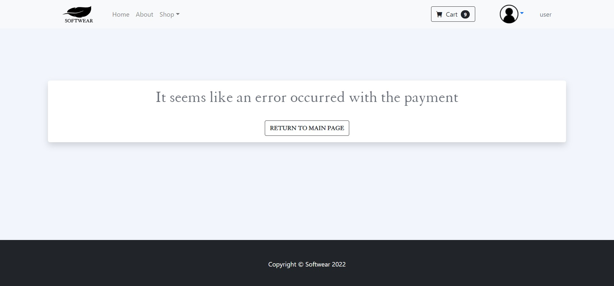
- Error Payment: shown when there is some error with the product payment.

\

- Error Pass: shown when user wants to change the password and the new ones don´t match.

\
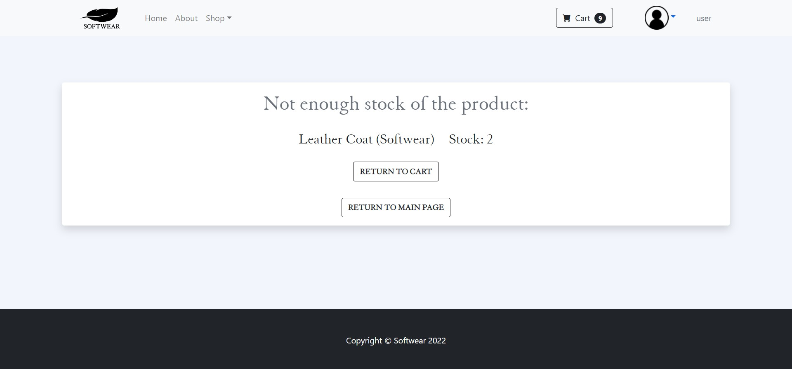
- Out of stock: reports there is no stock of a product that the user is trying to buy.

\
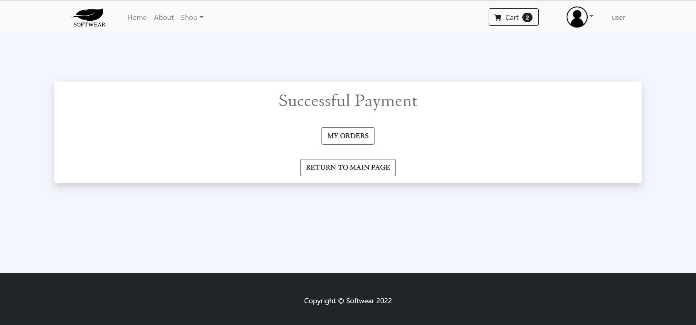
- Successful Payment: landing message when the purchase is correctly done.


## Entities

- User: admin, registered and non registered.
- Product
- Coupon
- Transaction

Property list of each entity:

### User
- rol: USER, ADMIN
- name
- lastName
- eMail
- password
- address
- phoneNumber
- birthDay
- transactionHistory
- userid
### Product
- price
- name
- description
- size
- stock
- brand
- supplier
- placeMade
- manufacturingDate
- productId

### Coupon
- code
- type
- startDate
- dateOfExpiry
- minimumForAplication
- discount
- affectedProducts
- couponId
### Transaction
- type: WISHLIST, TRANSACTION, CART
- userID
- usedCoupons
- Date
- ProductList
- transactionId
## Belongings

* Product:
	* Use: all
	* Owner: admin

* Coupon
	* Use: registered
	* Owner: admin

* Transaction
	* Use: registered
	* Owner: registered

## Diagrams
*Phase 2
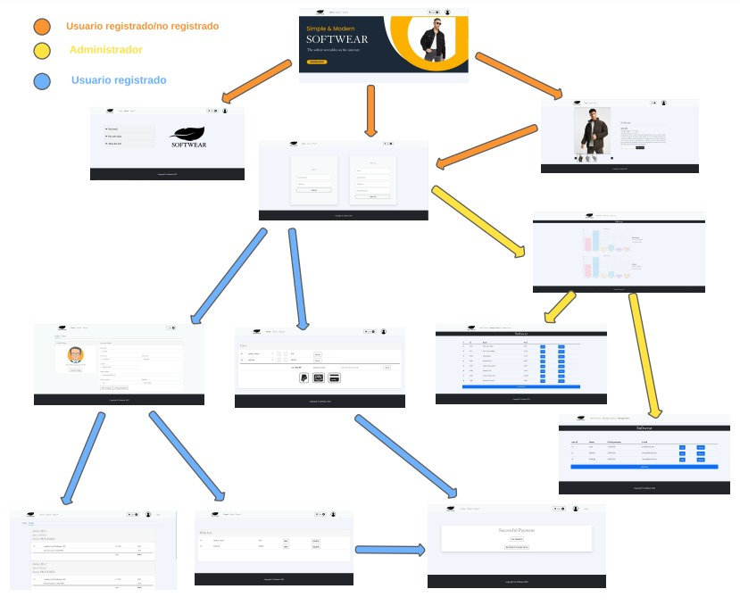
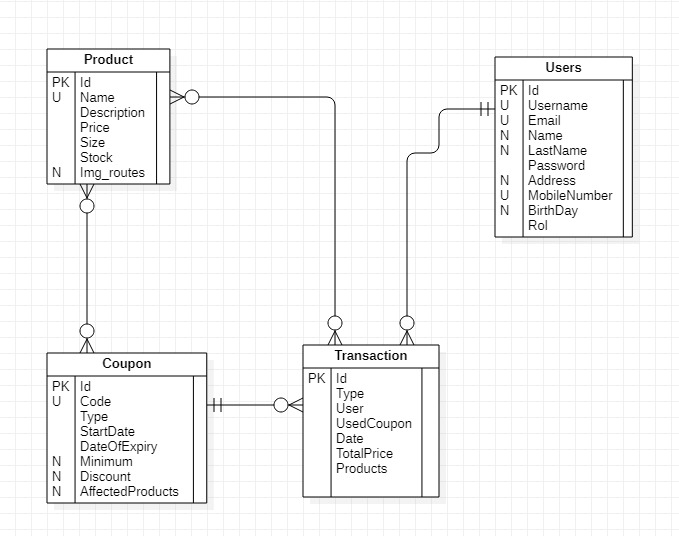
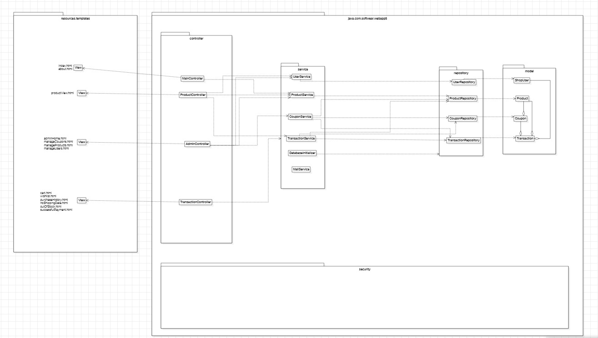
*Phase 3
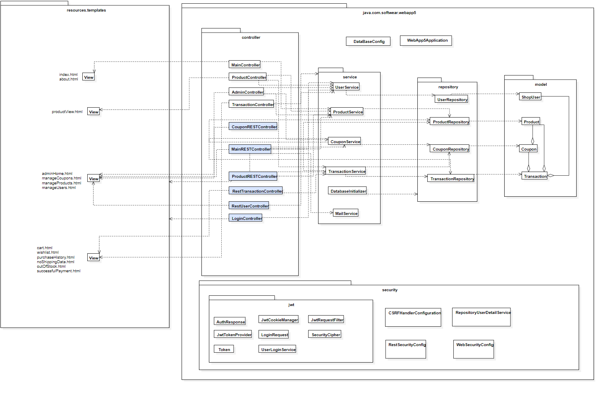

## Algorithms

Our app tracks the least favorite products and calculates a discount for them based on their popularity ranking and a minimum price every product has.

## Graphs

Our graph is a bar plot located at the admin panel and allows admins to track the volume of sales and their respective earnings.

## Extra technologies

We've implemented a mail function that sends the user a mail when they make a purchase with the product summary, price and transaction number for posible incidence.

## Tools

Link to our Trello: https://trello.com/b/7PcNfIHM/daw

## Execution instructions

Installation: 
	-Install PostgreSQL
	-Install pgAdmin4 (https://www.pgadmin.org/) and introduce a master password.
	
Versions: \
	-Java: 17 \
	-Maven: 4 \
	-SpringBoot: 2.6.3
	
Project compilation:

	-In our github, download the project as a zip.
	-Create a database named softwear.
	-In the IDE, execute
		>cd backend
		>mvn spring-boot:run
	then go to the browser and access https://localhost:8443/
	-To stop the proccess, press Ctr+C, enter and "S".
	
## Heroku

Url: https://codeurjc-daw-2021-22-webapp5.herokuapp.com/

User credentials: 

* admin:pass
* user:pass


### Heroku Deployment

In order to deploy the application with heroku, you must create a heroku account and install heroku and docker clients.

First, you need to log in and create a new application with the following commands:

```bash
heroku login
heroku create <app-id>
```

Then, you need to pull our application image from DockerHub for pushing it into the heroku repository:

```bash
docker image pull softwearDAW/codeurjc-daw-2021-22-webapp5
```

You need to log in heroku repository and push the downloaded application image into your application repository. You could do it with the following commands:

```bash
# Log in heroku repository
heroku container:login
# Change image name
docker image tag softweardaw/codeurjc-daw-2021-22-webapp5:latest registry.heroku.com/<app-id>/web:latest
# Push image
docker push registry.heroku.com/<app-id>/web
```

Then you need to configure the database. You can add the database to your heroku app running the following command:

```bash
heroku addons:create heroku-postgresql --app <app-id>
```

You need to set the environment variables running the following command:

```bash
heroku config:set \
	SERVER_SSL_ENABLED=false \
	SPRING_JPA_HIBERNATE_DDL-AUTO=update \
	MAILER_EMAIL=<mailer-email> \
	MAILER_PASS=<mailer-pass> \
	--app <app-id>
```

Finally, you could release the application running the following command:

```bash
heroku container:release web --app <app-id>
```

---

You could destroy the application running the following command:

```bash
heroku apps:destroy --app <app-id>
```


## Docker

### Application Execution - Docker Compose

You need to install the docker client and docker-compose. You would use the docker-compose.yml file in the docker directory.

You need to specify an email for your mail service. If you don't, the application's mail service will not work. You should specify it in a environment variable named MAILER_EMAIL.

You need to do the same in order to specify the service's password. It is set in the variable MAILER_PASS.

You could execute the following command in order to set those variables and run the application:

```bash
# If you have a docker-compose version previous to version 2, you should use the command docker-compose up

env MAILER_EMAIL=<your-mailer-email> MAILER_PASS=<your-mailer-pass> docker compose up
```

### Build the image

In order to build the image with the executable file you sould change your wd to docker directory and execute:

```bash
./create_image.sh
```

You need to install docker in your system in order to execute this script. Also, you may need execute it as root.

## Api REST documentation

* [OpenApi JSON](https://github.com/CodeURJC-DAW-2021-22/webapp5/blob/main/api-docs/api-docs.json)
* [OpenApi HTML](https://rawcdn.githack.com/CodeURJC-DAW-2021-22/webapp5/0becb842fc6f969684dcde3be654949e32f543b6/api-docs/api-docs.html)
	
## Participation

### Phase 2

#### Adrián

I've been focused on transaction's block and coupon's block but I've been making changes and functions for nearly all classes.

##### Important Commits

Among others, the more outstanding commits are:
* [Wishlist transaction](https://github.com/CodeURJC-DAW-2021-22/webapp5/commit/c933892be32c817ce1a583a67637f4fe3f2d3256): Where TransactionView was created.
* [Added purchase history](https://github.com/CodeURJC-DAW-2021-22/webapp5/commit/2f0e982e571a3e7c8899af9075fa8f4c2e423b07)
* [AJAX in Cart](https://github.com/CodeURJC-DAW-2021-22/webapp5/commit/4a582b5ce05bd9357f166c170a68b5e943e1059c)
* [AJAX in Wishlist](https://github.com/CodeURJC-DAW-2021-22/webapp5/commit/1fc2f798529c074b1b42f8a1039fec2e63fff5cb)
* [CSRF enabled (NOT STABLE)](https://github.com/CodeURJC-DAW-2021-22/webapp5/commit/e3570a268d569428e396abba310dd30f84f3b3b5)

Those commits are develop versions of the files and they may have errors that have been fixed in other commits. For further information about it, you should check the version history of the file.

##### Important Files

Among others, the more outstanding files are:
* [Transaction.java (com.softwear.webapp5.model.Transaction)](https://github.com/CodeURJC-DAW-2021-22/webapp5/blob/main/backend/src/main/java/com/softwear/webapp5/model/Transaction.java)
* [Coupon.java (com.softwear.webapp5.model.Coupon)](https://github.com/CodeURJC-DAW-2021-22/webapp5/blob/main/backend/src/main/java/com/softwear/webapp5/model/Coupon.java)
* [CouponService.java (com.softwear.webapp5.service.CouponService)](https://github.com/CodeURJC-DAW-2021-22/webapp5/blob/main/backend/src/main/java/com/softwear/webapp5/service/CouponService.java)
* [TransactionController.java (com.softwear.webapp5.controller.TransactionController)](https://github.com/CodeURJC-DAW-2021-22/webapp5/blob/main/backend/src/main/java/com/softwear/webapp5/controller/TransactionController.java)
* [TransactionRESTController.java (com.softwear.webapp5.controller.TransactionRESTController)](https://github.com/CodeURJC-DAW-2021-22/webapp5/blob/main/backend/src/main/java/com/softwear/webapp5/controller/TransactionRESTController.java)

Apart from those files, i've been working on a lot of the project files. For further information about them, you should check commits filtering by my user.

#### Mario and Ana

Mario and Ana have been working together at the same files. We have created Admin Home graphic with sellings data of database, created access to available sizes of each product, product entity creation and all its main classes to control, creation of example data of data base in databaseinitializer and readme documentation.

##### Important Commits

Among others, the more outstanding commits are:
* [Moustache and data base examples added](https://github.com/CodeURJC-DAW-2021-22/webapp5/tree/0585033f4588811d333048bb0b78fc6fea65040e).
* [Product controller refactorization and GetMapping addition](https://github.com/CodeURJC-DAW-2021-22/webapp5/tree/2a73df1efe6de911879ca7f8973a983fb0119612).
* [Product FindBy ](https://github.com/CodeURJC-DAW-2021-22/webapp5/tree/b015f27360e9f27c9c202fa345a8acf2dade9e79).
* [New transactions on data base and products modification](https://github.com/CodeURJC-DAW-2021-22/webapp5/tree/a3201beb78a9ce4d5700cdd7ee6528afa776d1be).
* [Readme documentation](https://github.com/CodeURJC-DAW-2021-22/webapp5/tree/9a1a97a8776a511b9e1391e8e6f2c6f2554a0d6a).


##### Important Files

Among others, the more outstanding files are:
* Chart.js
* TransactionController.java
* Product.java
* ProductRepository.java
* Databaseinitializer.java

Also other files of the project. For further information about them, you should check commits filtering by our users.

#### Jorge

I developed almost all things relationated with users, also i worked on doing the web pageable and on the 
security package but I helped on the develop of other classes and functionalities.

##### Important Commits

* [User and BBDD](https://github.com/CodeURJC-DAW-2021-22/webapp5/commit/d6e2112438bfaafeef317de0f80da209bef0e202)
* [Logger and Pass encoder](https://github.com/CodeURJC-DAW-2021-22/webapp5/commit/1feebc1a7d01ae4f384130e1490a7fcf4298255b)
* [Index pageable](https://github.com/CodeURJC-DAW-2021-22/webapp5/commit/a3d66451529d5a6d7ff2f2b5d78045200ea01d7d)
* [Added user entity](https://github.com/CodeURJC-DAW-2021-22/webapp5/commit/b6a190f6ace0430ee48492adab1cd7a2f0cbbf9d)
* [Added Sign up](https://github.com/CodeURJC-DAW-2021-22/webapp5/commit/a92d4a79f9a1f65f399783ff965692a7fcb1a5b4)

Maybe this commits dont show the final version of the files.

##### Important Files

* [ShopUser.java](https://github.com/CodeURJC-DAW-2021-22/webapp5/blob/main/backend/src/main/java/com/softwear/webapp5/model/ShopUser.java)
* [UserController.java](https://github.com/CodeURJC-DAW-2021-22/webapp5/blob/main/backend/src/main/java/com/softwear/webapp5/controller/UserController.java)
* [UserService.java](https://github.com/CodeURJC-DAW-2021-22/webapp5/blob/main/backend/src/main/java/com/softwear/webapp5/service/UserService.java)
* [AdminController.java](https://github.com/CodeURJC-DAW-2021-22/webapp5/blob/main/backend/src/main/java/com/softwear/webapp5/controller/AdminController.java)
* [WebSecurityConfig.java](https://github.com/CodeURJC-DAW-2021-22/webapp5/blob/main/backend/src/main/java/com/softwear/webapp5/security/WebSecurityConfig.java)

I also worked on other files but the most time i spent working are on this files.

#### Pablo

I developed the managers for the entities in the admin side: manage users, manage products and manage coupons. They all had an HTML, js and AJAX in the frontside
and backend related in AdminController and RestAdminController, as well as in the services and repositories they used.
I also developed the about and error page and divided the HTMLs in header (or adminHeader), body and footer in separate files.
I helped develop the Coupon entity.
I coded the general algorithm to suggest coupons that looks at the least frequently bought products and suggest a coupon for them.

##### Important Commits

* [frontend manageCoupons done](https://github.com/CodeURJC-DAW-2021-22/webapp5/commit/f93bdb08cbaca30ced7c1362210f17ff4674b91d)
* [restController_done](https://github.com/CodeURJC-DAW-2021-22/webapp5/commit/487ff8721a78b0642494e9f976a9b27957a8e800)
* [manageUsers_final](https://github.com/CodeURJC-DAW-2021-22/webapp5/commit/cde08a090d23dcb464b20efc4a08abf16f8fddd2)
* [adminController](https://github.com/CodeURJC-DAW-2021-22/webapp5/commit/e16b76e17cfbb999d527ee325325e7233d252a4a)
* [divided_views](https://github.com/CodeURJC-DAW-2021-22/webapp5/commit/69ff003e314642a2f7b1e1bca003f4317ae31f74)

##### Important Files

* [AdminController.java](https://github.com/CodeURJC-DAW-2021-22/webapp5/blob/main/backend/src/main/java/com/softwear/webapp5/controller/AdminController.java)
* [RestAdminController.java](https://github.com/CodeURJC-DAW-2021-22/webapp5/blob/main/backend/src/main/java/com/softwear/webapp5/controller/RestAdminController.java)
* [manageUsers.js](https://github.com/CodeURJC-DAW-2021-22/webapp5/blob/main/backend/src/main/java/com/softwear/webapp5/model/ShopUser.java)
* [manageProducts.js](https://github.com/CodeURJC-DAW-2021-22/webapp5/blob/main/backend/src/main/resources/static/js/manageProducts.js)
* [manageCoupons.js](https://github.com/CodeURJC-DAW-2021-22/webapp5/blob/main/backend/src/main/resources/static/js/manageCoupons.js)

### Phase 3

#### Pablo

I developed the coupon and transaction REST controllers, as well as the needed methods in the controllers and respositories that were missing.

##### Important Commits

* [[WORKING] CouponREST (and transactionREST) fixed](https://github.com/CodeURJC-DAW-2021-22/webapp5/commit/1483cdc14b6a49bf6b2b45b47454ceceba19b6be)
* [CouponRESTController [DELETE NOT WORKING due to foreign key violation in transaction]](https://github.com/CodeURJC-DAW-2021-22/webapp5/commit/030e14945065bc85f7222eaa17196cd97b807c42)
* [RestTransactionController finished](https://github.com/CodeURJC-DAW-2021-22/webapp5/commit/d5da83886b65203448cd9d316bb40155a350bfe7 )
* [[NOT WORKING] modified RestTransactionController to map all types of transactions to the same action](https://github.com/CodeURJC-DAW-2021-22/webapp5/commit/50cb33b5488f95f848eec87905fa783df30b6eb7)
* [[NOT FULLY WORKING] RestTransactionController
](https://github.com/CodeURJC-DAW-2021-22/webapp5/commit/2bcd0ca71f8cf3ea20022606d3e0d9bc748192ae)

##### Important Files

* [RestTransactionController.java](https://github.com/CodeURJC-DAW-2021-22/webapp5/blob/main/backend/src/main/java/com/softwear/webapp5/controller/RestTransactionController.java)
* [CouponRESTController.java](https://github.com/CodeURJC-DAW-2021-22/webapp5/blob/main/backend/src/main/java/com/softwear/webapp5/controller/CouponRESTController.java)

#### Jorge

I worked on the user REST controller, also deployed the security jwt and Login Controller, but i worked on other controllers and javascripts files to fix some errors.

##### Important Commits

* [Added JWT and RestSecurityConfig](https://github.com/CodeURJC-DAW-2021-22/webapp5/commit/6815fe7128d05116f993584034f4d4c346549df6)
* [Api Rest User done](https://github.com/CodeURJC-DAW-2021-22/webapp5/commit/e34b8a630f41a2693012ad8a1b3cd5cd84fd4aae)
* [Login and logout done](https://github.com/CodeURJC-DAW-2021-22/webapp5/commit/1a2107ae0db12c7a775f213653a003765c9b9664)
* [Ajax and api rest added to user info](https://github.com/CodeURJC-DAW-2021-22/webapp5/commit/425b6070ce3c9cd266658aac9867ca80d9ce7c46)
* [Token added and fixes](https://github.com/CodeURJC-DAW-2021-22/webapp5/commit/be7012ec84e957c1dcc20e766d53761db96682c9)

##### Important Files

* [RestUserController.java](https://github.com/CodeURJC-DAW-2021-22/webapp5/blob/develop/backend/src/main/java/com/softwear/webapp5/controller/RestUserController.java)
* [PassChange.java](https://github.com/CodeURJC-DAW-2021-22/webapp5/blob/develop/backend/src/main/java/com/softwear/webapp5/data/PassChange.java)
* [ManageUsers.js](https://github.com/CodeURJC-DAW-2021-22/webapp5/blob/develop/backend/src/main/resources/static/js/manageUsers.js)

#### Adrián

I've been working on the docker files and the deploy on heroku. Also, I worked in other parts of the project, like REST controllers.

##### Important Commits

* [Docker image creation](https://github.com/CodeURJC-DAW-2021-22/webapp5/commit/422ae9104d9d35da115b84bf05318cf05e8d6a2e)
* [Added docker-compose file](https://github.com/CodeURJC-DAW-2021-22/webapp5/commit/48ba50f1b6c83192ea4f7f201395cc662826b440)
* [Added memory limit](https://github.com/CodeURJC-DAW-2021-22/webapp5/commit/48bafbd4bb8f4fe70ae301a07c40532d9b35ad70)
* [Added heroku database changes](https://github.com/CodeURJC-DAW-2021-22/webapp5/commit/c06c627a3809abbcedf5ee31dd89eec0711dbed0)
* [Added Heroku documentation](https://github.com/CodeURJC-DAW-2021-22/webapp5/commit/eb7e06bbb18f27d6ba4cf77ba77607d09ceed70e)

##### Important Files

* [webapp-compile.Dockerfile](https://github.com/CodeURJC-DAW-2021-22/webapp5/blob/main/docker/webapp5-compile.Dockerfile)
* [create_image.sh](https://github.com/CodeURJC-DAW-2021-22/webapp5/blob/main/docker/create_image.sh)
* [docker-compose.yml](https://github.com/CodeURJC-DAW-2021-22/webapp5/blob/main/docker/docker-compose.yml)
* [pom.xml](https://github.com/CodeURJC-DAW-2021-22/webapp5/blob/main/backend/pom.xml)
* [application.properties](https://github.com/CodeURJC-DAW-2021-22/webapp5/blob/main/backend/src/main/resources/application.properties)

##### Ana
I have been working in Images uploads, being possible to upload more than a single one, in manageProducts, as well as some changes in productRestController.

##### Important Commits

* [Multiple images upload fixed](https://github.com/CodeURJC-DAW-2021-22/webapp5/commit/b080006a3cc033d76822b7b4876470eb3023744b )
* [API images in RestAdminController fixed](https://github.com/CodeURJC-DAW-2021-22/webapp5/commit/34bb9aec780caff2ba5585db8854d8913175176e)

##### Important Files

* [manageProducts.js](https://github.com/CodeURJC-DAW-2021-22/webapp5/blob/develop/backend/src/main/resources/static/js/manageProducts.js)
* [ProductRESTController.java](https://github.com/CodeURJC-DAW-2021-22/webapp5/blob/619fbfd71c39d6adb520ca90c37382069ea73e9a/backend/src/main/java/com/softwear/webapp5/controller/ProductRESTController.java)

##### Mario
I have worked in the images uploads when creating a new product, as well as creating the api REST of product and the product Postman petitions.

##### Important Commits

* [Images Post functionality fixed](https://github.com/CodeURJC-DAW-2021-22/webapp5/commit/04b042f96a7ce67e454274ca06cd43b021855542)
* [Product's basic methods and images get and post mapping created in REST](https://github.com/CodeURJC-DAW-2021-22/webapp5/commit/068c0eae4c2b093826ced445361b9892b5d6e38f)
* [Delete and post images fixed](https://github.com/CodeURJC-DAW-2021-22/webapp5/commit/21ec7d94bd7e95c4a875eb4fed9d7695e28176da)

##### Important Files

* [manageProducts.js](https://github.com/CodeURJC-DAW-2021-22/webapp5/blob/619fbfd71c39d6adb520ca90c37382069ea73e9a/backend/src/main/resources/static/js/manageProducts.js)
* [PoductRESTController.java](https://github.com/CodeURJC-DAW-2021-22/webapp5/blob/619fbfd71c39d6adb520ca90c37382069ea73e9a/backend/src/main/java/com/softwear/webapp5/controller/ProductRESTController.java)
